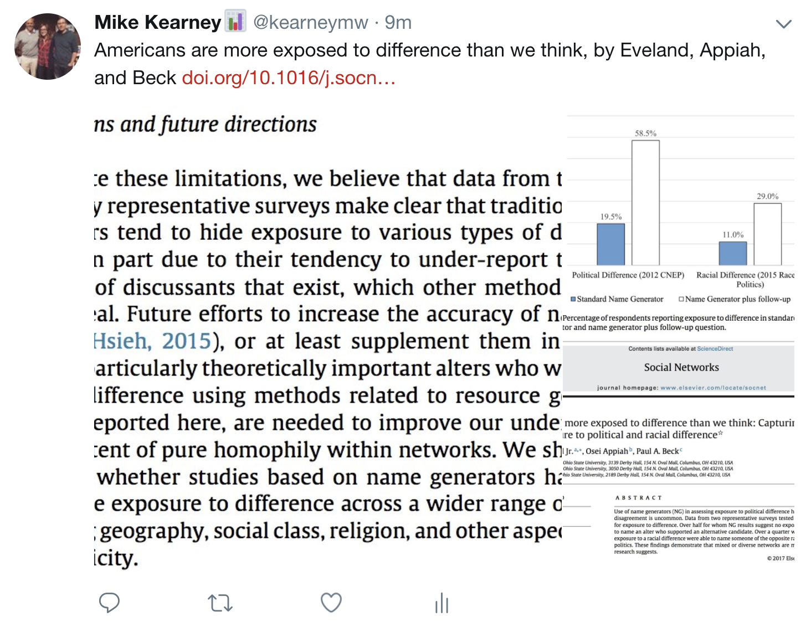
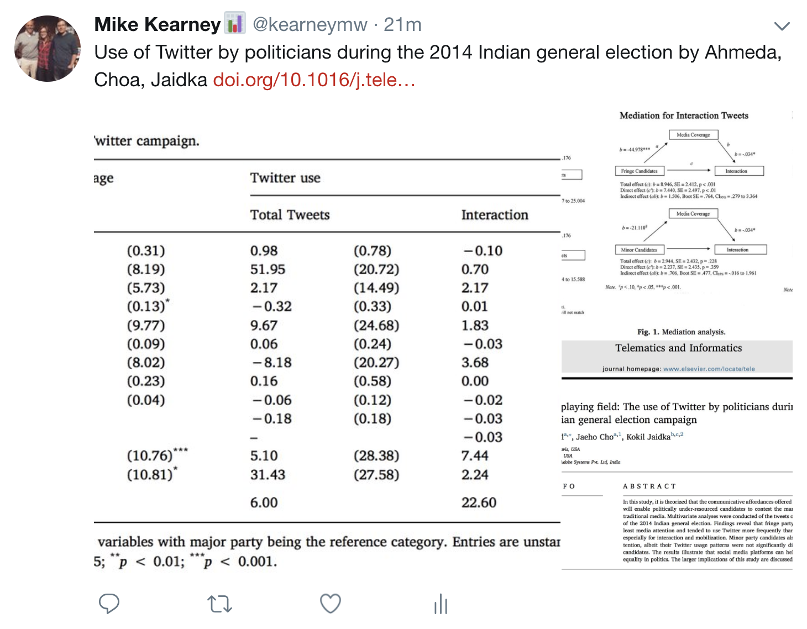

## ss2twitter
A repo for posting screen shots to Twitter.

## examples
I posted [the tweets pictured below](.make.R) using files in this repo +
[rtweet](https://github.com/mkearney/rtweet).

## inspiration
This repo was inspired by wonderful research tweets frequently posted
by [@JohnHolbein1](https://twitter.com/JohnHolbein1).
